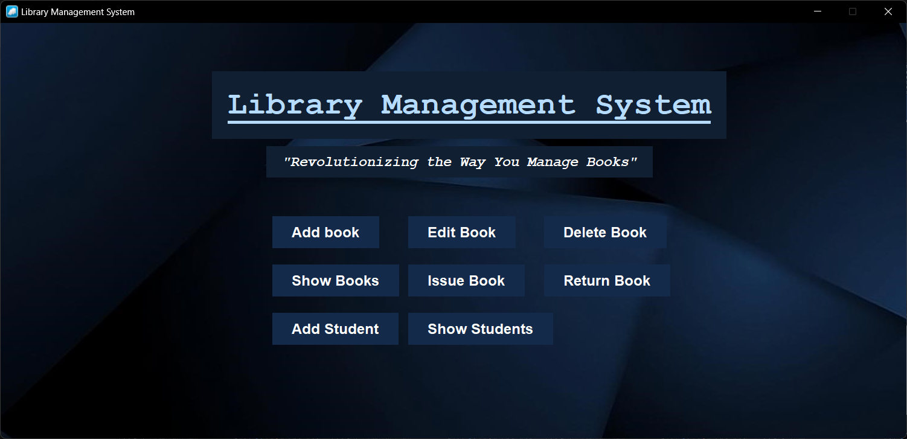
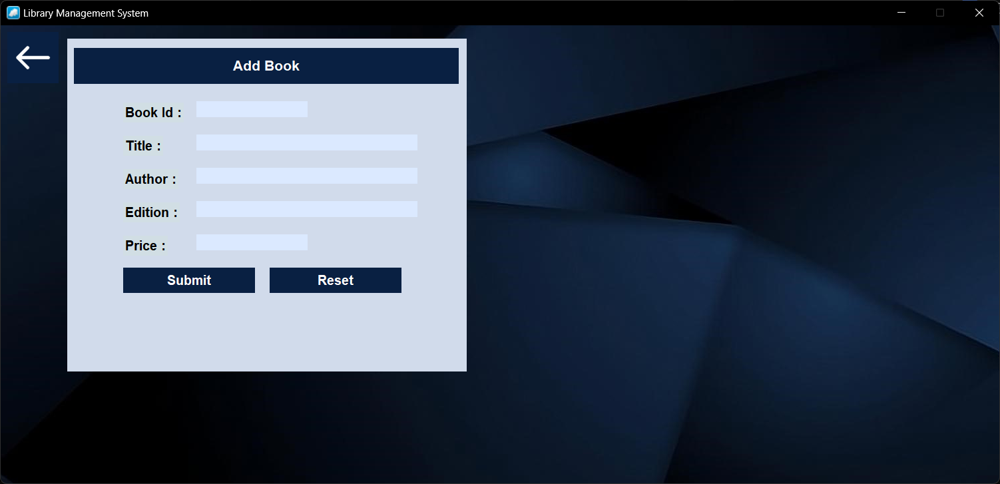
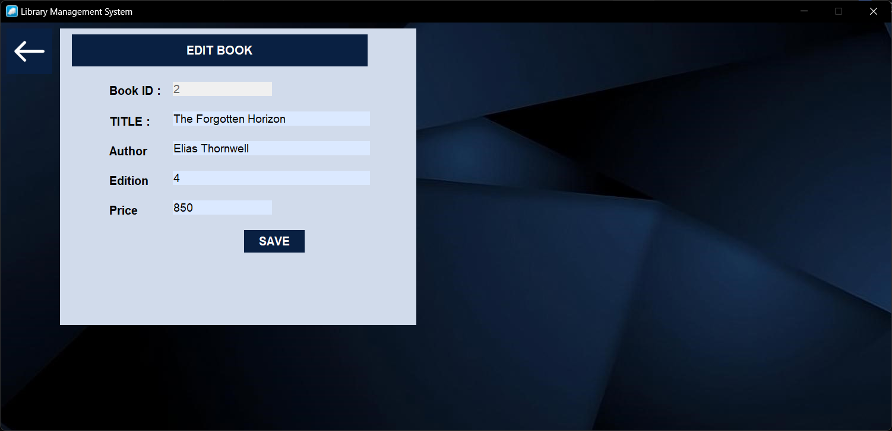
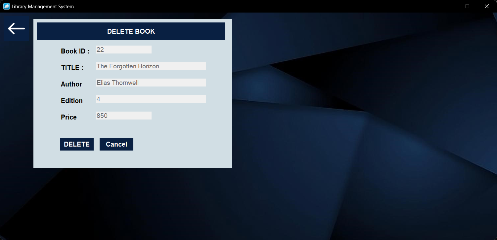
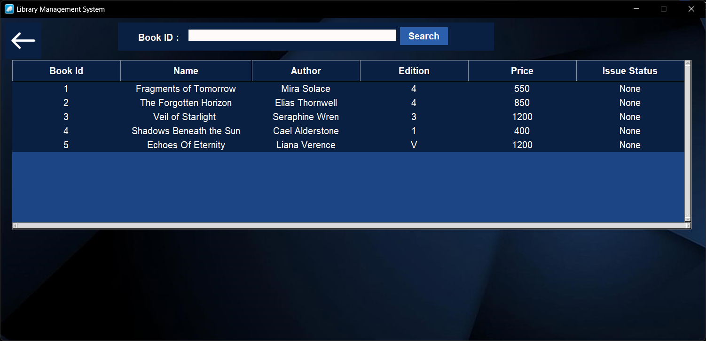
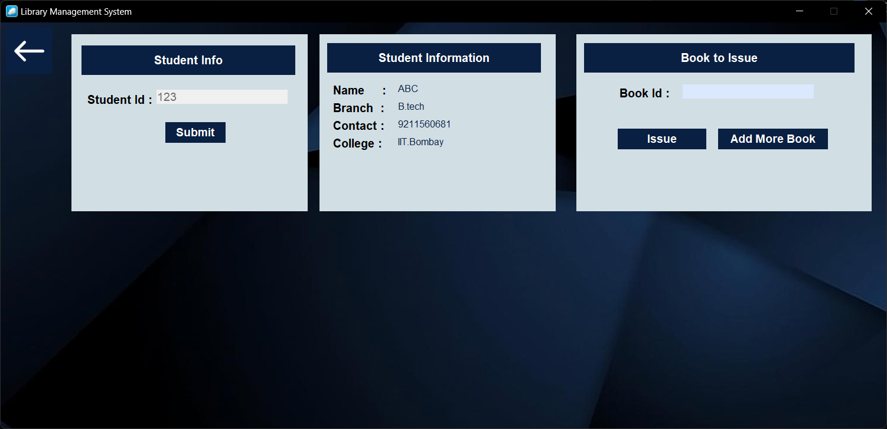
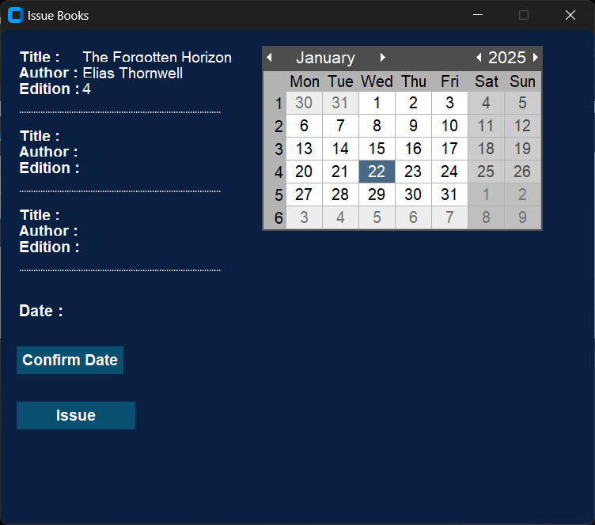
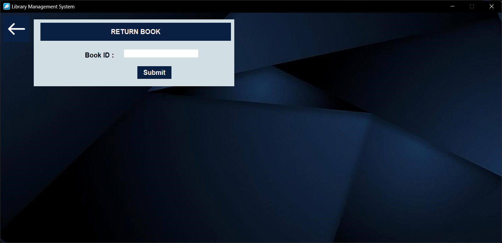

<p align="center">
  
</p>

<h1 align="center">🧿 Library Management System</h1>

<p align="center">
  A desktop-based Library Management System built with <strong>Python</strong>, <strong>Tkinter / CustomTkinter</strong>, and <strong>MySQL</strong>.
  <br>
  It helps manage books, students, issue/return operations, and overdue fines through a clean graphical interface.
</p>

<p align="center">
  
  
  
  
  
</p>

<p align="center">
  <a href="#-overview">Overview</a> •
  <a href="#-features">Features</a> •
  <a href="#-technologies-used">Technologies Used</a> •
  <a href="#-project-structure">Project Structure</a> •
  <a href="#-requirements">Requirements</a> •
  <a href="#-installation">Installation</a> •
  <a href="#-database-setup">Database Setup</a> •
  <a href="#-how-to-run">How to Run</a> •
  <a href="#-database-schema">Database Schema</a> •
  <a href="#-screenshots">Screenshots</a> •
  <a href="#-demo">Demo</a> •
  <a href="#-future-improvements">Future Improvements</a> •
  <a href="#-license">License</a> •
  <a href="#-author">Author</a>
</p>


## 🔵 Overview

The **Library Management System** is a desktop application designed to simplify everyday library operations. It provides a structured way to manage:

- book records
- student records
- book issuing and returning
- overdue fine calculation
- searchable table views for books and students

The application uses a MySQL database for persistent storage and a CustomTkinter-based interface for a modern desktop experience.


## 🔵 Features

### Book Management
- Add new books with:
  - Book ID
  - Title
  - Author
  - Edition
  - Price
- Edit existing book details
- Delete books from the library
- View all books in a tabular format
- Search books by Book ID

### Student Management
- Add new students with:
  - Roll No.
  - Student Name
  - Course / Branch
  - Phone Number
  - College Name
- View all students in a table
- Search students by Roll No.

### Issue Book
- Fetch student details using Roll No.
- Issue books to students
- Allow a maximum of **3 active books** per student
- Select due date using a calendar widget
- Automatically update:
  - book status
  - issued-to field
  - issue transaction record

### Return Book
- Return books by entering Book ID
- Check whether the book is issued
- Calculate overdue fine automatically
- Fine is charged at **₹2 per day**
- Confirm fine payment before updating book status

## 🔵 Technologies Used

- **Python 3**
- **Tkinter** – GUI framework
- **CustomTkinter** – Modern Tkinter widgets
- **PyMySQL** – MySQL database connectivity
- **MySQL** – Data storage
- **tkcalendar** – Date selection widget
- **ctypes / dwmapi** – Windows title bar customization


## 🔵 Project Structure

```bash
library-management-system/
│
├── library_management.py
├── bg.png
├── back.png
├── icon.ico
├── video.mp4
├── screenshots/
│   ├── banner.png
│   ├── 1.png
│   ├── 2.png
│   ├── 3.png
│   ├── 4.png
│   ├── 5.png
│   ├── 6.png
│   ├── 7.png
│   └── 8.png
└── README.md
```


## 🔵 Requirements

Before running the project, make sure you have:
* Python 3.x installed
* MySQL Server installed and running
* The required Python packages installed
* The image assets and icon placed in the same directory as the script

### Python Packages

```bash
pip install customtkinter pymysql tkcalendar
```


## 🔵 Installation

### 1. Clone or Download the Project

Download the source code and place all files in a single folder.

### 2. Install Dependencies

Run:

```bash
pip install customtkinter pymysql tkcalendar
```

### 3. Start MySQL Server

Make sure MySQL is running on your system.

### 4. Check the Assets

Ensure the following files are available in the project directory:
* `bg.png`
* `back.png`
* `icon.ico`


## 🔵 Database Setup

The application automatically tries to create the database and tables on first run.

Default MySQL Credentials Used in the Code
* **Host:** `localhost`
* **User:** `root`
* **Password:** `root`
If your MySQL credentials are different, update them in the script before running the application.


## 🔵 How to Run
```bash
python library_management.py
```

After launching, the application will open the dashboard interface where you can access all modules.


## 🔵 Database Schema

### `storebook`

Stores all book details.

| Column       | Type            | Description            |
| ------------ | --------------- | ---------------------- |
| bookid       | INT PRIMARY KEY | Unique book ID         |
| title        | VARCHAR(100)    | Book title             |
| author       | VARCHAR(50)     | Author name            |
| edition      | VARCHAR(50)     | Edition                |
| issue_status | VARCHAR(1000)   | Book issue state       |
| issued_to    | VARCHAR(1000)   | Roll number of student |
| price        | INT             | Book price             |

### `bookissued_data`

Stores book issue transaction details.

| Column    | Type            | Description         |
| --------- | --------------- | ------------------- |
| roll_no   | INT             | Student roll number |
| from_date | DATE            | Issue date          |
| to_date   | DATE            | Due date            |
| bookid    | INT PRIMARY KEY | Book ID             |

### `student_data`

Stores student information.

| Column         | Type               | Description         |
| -------------- | ------------------ | ------------------- |
| roll_no        | BIGINT PRIMARY KEY | Student roll number |
| student_name   | VARCHAR(100)       | Student name        |
| student_course | VARCHAR(50)        | Course / branch     |
| phone          | NUMERIC(10)        | Contact number      |
| college_name   | VARCHAR(25)        | College name        |


## 🔵 Screenshots

<table>
  <tr>
    <td align="center">
      <strong>Dashboard</strong><br><br>
      
    </td>
    <td align="center">
      <strong>Add Book</strong><br><br>
      
    </td>
  </tr>

  <tr>
    <td align="center">
      <strong>Edit Book</strong><br><br>
      
    </td>
    <td align="center">
      <strong>Delete Book</strong><br><br>
      
    </td>
  </tr>

  <tr>
    <td align="center">
      <strong>Book Table</strong><br><br>
      
    </td>
    <td align="center">
      <strong>Student Info</strong><br><br>
      
    </td>
  </tr>

  <tr>
    <td align="center">
      <strong>Book Issue</strong><br><br>
      
    </td>
    <td align="center">
      <strong>Return Book</strong><br><br>
      
    </td>
  </tr>
</table>


## 🔵 License
This project is open-source and available under the **MIT License**.

## 🔵 Author

**Ashish Kumar**
